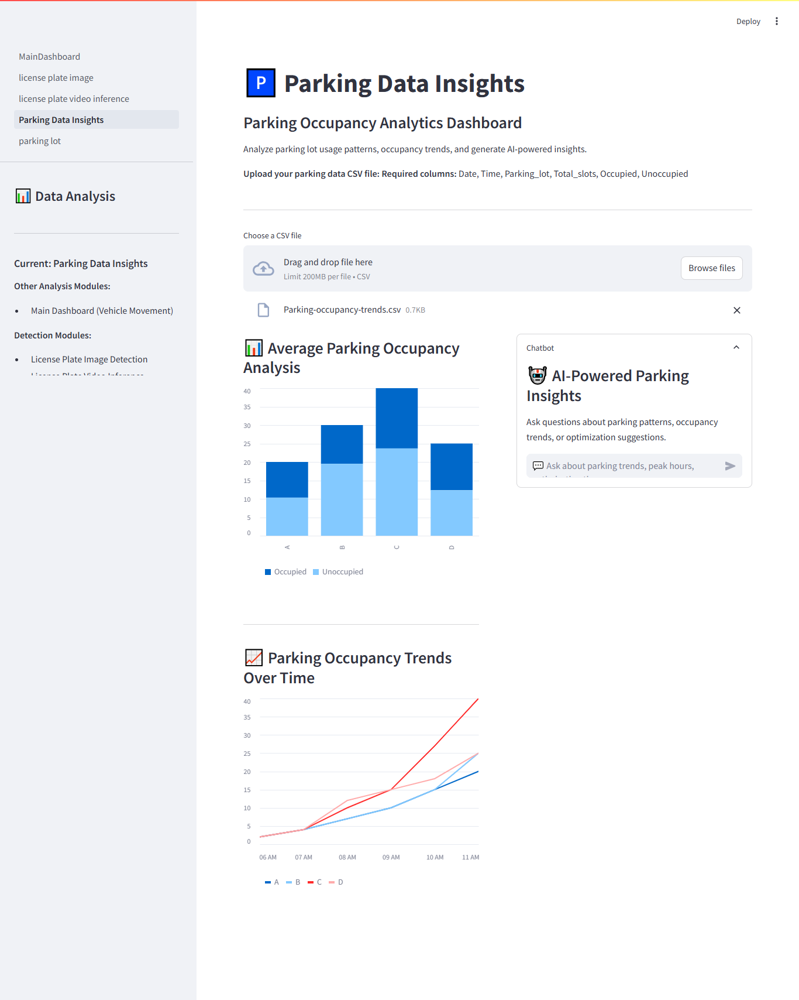

# 🚗 Parklytics with PlatePulse : Vehicle License Plate Recognition & Parking Management System with Edge AI Analytics

### <div align="center">Intel Unnati Industrial Training Program 2024</div>
### <div align="center">Department of CSE-AIML, Sreenidhi Institute of Science and Technology, Hyderabad</div>

## <div align="center">Advanced Edge AI Solution for Vehicle Movement Analysis and Parking Management 🚀</div>

### <div align="center">Powered by YOLOv8, LPRNet, and Google Gemini AI</div>

---

## 📋 Project Description

**A powerful edge AI-based tool for vehicle entry and exit checking, parking lot occupancy evaluation, and insight generation.** This comprehensive system combines computer vision, deep learning, and natural language processing to provide intelligent solutions for modern vehicle and parking management challenges.

---

## 🎯 Project Overview

**Parklytics with PlatePulse ** is a comprehensive edge AI-powered system that revolutionizes vehicle movement analysis and parking management through intelligent automation. The system seamlessly integrates real-time license plate recognition, automated parking occupancy monitoring, and AI-driven insights to deliver a complete solution for modern traffic and parking management challenges in educational institutions, corporate campuses, and urban environments.

### Key Capabilities:
- 🔍 **Real-time License Plate Detection & OCR** using YOLOv8 + LPRNet
- 🅿️ **Automated Parking Space Monitoring** with occupancy analysis
- 📊 **Interactive Data Analytics** with LLM-powered insights
- ⚡ **Edge AI Optimization** for fast inference (59.38ms average)
- 🌐 **Web-based Interface** built with Streamlit

---

## 🛠️ Installation & Setup

### Prerequisites
- Python 3.8+
- Virtual Environment (recommended)

### Step 1: Clone Repository
```bash
git clone <repository-url>
cd IntelUnnati2024TTS-main
```

### Step 2: Create Virtual Environment
```bash
# Create virtual environment
python -m venv venv

# Activate virtual environment
# Windows:
venv\Scripts\activate
# Linux/Mac:
source venv/bin/activate
```

### Step 3: Install Dependencies
```bash
pip install -r requirements.txt
```

### Step 4: Configure API Keys
In the MainDashboard.py and Parking Data Insights files, replace with your Google Gemini API Key:
```python
os.environ['GOOGLE_API_KEY'] = "YOUR_GOOGLE_API_KEY"
```

### Step 5: Launch Application
```bash
cd streamlit
python -m streamlit run MainDashboard.py
```

---

## 🏗️ System Architecture

### 🔍 Detection Modules
- **License Plate Image Detection** - Single image processing with OCR
- **License Plate Video Analysis** - Video processing with consecutive frame verification
- **Parking Lot Monitoring** - Real-time occupancy detection

### 📊 Data Analytics & Insights
- **Vehicle Movement Dashboard** - Traffic pattern analysis and visualization
- **Parking Analytics** - Occupancy trends and optimization insights
- **AI-Powered Chat** - Natural language queries using Google Gemini

### 🖥️ CLI Tools
```bash
# License plate detection
cd src
python model_inference.py -i image.jpg
python model_inference.py -v video.mp4

# Parking space detection
python parking_inference.py -i parking_image.jpg
python parking_inference.py -v parking_video.mp4
```

---

## 🎨 Application Screenshots

### 🔍 Detection Modules

#### License Plate Image Detection

*Real-time license plate recognition with confidence scoring and ROI visualization*

#### License Plate Video Analysis

*Video-based detection with consecutive frame verification to eliminate false positives*

#### Parking Lot Detection

*Automated parking space monitoring with visual occupancy indicators*

### 📊 Data Analytics & Insights

#### Vehicle Movement Analysis Dashboard

*Comprehensive traffic analytics with time-series visualization and AI insights*

#### Parking Data Insights

*Advanced parking analytics with occupancy trends and optimization recommendations*

---

## ⚡ Performance Features

### 🚀 Edge AI Optimization
- **Ultra-fast Inference**: 59.38ms combined processing time on Ryzen 5 CPU
- **Model Formats**: PyTorch, ONNX, OpenVINO, TensorFlow Lite, NCNN
- **INT8 Quantization**: Optimized for edge deployment
- **GPU/CPU Support**: Automatic device detection

### 🎯 Smart Detection
- **Consecutive Frame Verification**: Eliminates false positives in video analysis
- **Robust OCR**: Trained on 20,000+ diverse license plate images
- **Multi-format Support**: Handles various image and video formats
- **Real-time Processing**: Live inference with performance monitoring

### 🧠 AI-Powered Insights
- **Natural Language Queries**: Chat-based data analysis using Google Gemini
- **Interactive Visualizations**: Dynamic charts and graphs with Plotly
- **Export Functionality**: CSV downloads for further analysis
- **Custom Data Upload**: Support for user-provided datasets

---

## 📁 Project Structure

```
Parklytics with PlatePulse /
├── 📂 data/                    # Training datasets and references
├── 📂 models/                  # Trained AI models (multiple formats)
├── 📂 notebooks/               # Jupyter training notebooks
├── 📂 scripts/                 # Utility and preprocessing scripts
├── 📂 src/                     # CLI inference modules
├── 📂 streamlit/               # Web application
│   ├── 🏠 MainDashboard.py     # Main analytics dashboard
│   └── 📂 pages/               # Detection and analysis modules
├── 📂 test_data/               # Sample test files
├── 📂 streamlit/               # Web application
│   ├── 🏠 MainDashboard.py     # Main analytics dashboard
│   ├── 📂 demo_/               # Application screenshots
│   └── 📂 pages/               # Detection and analysis modules
└── 📄 requirements.txt         # Python dependencies
```

---

## 🎯 Key Achievements

✅ **Real-time Processing**: Near-instantaneous vehicle detection and analysis  
✅ **High Accuracy**: Robust performance across diverse lighting and angle conditions  
✅ **Modular Design**: Independent modules that work together seamlessly  
✅ **User-friendly Interface**: Intuitive web application with drag-and-drop functionality  
✅ **Scalable Architecture**: Supports both single-image and batch processing  
✅ **AI Integration**: Natural language insights and recommendations  

---

## 📚 Documentation

- 📖 [Streamlit App Guide](STREAMLIT_APP_DOCUMENTATION.md) - Complete web application documentation
- 🏗️ [Project Architecture](PROJECT_ARCHITECTURE_DOCUMENTATION.md) - Technical implementation details

---

## 🔧 Technical Specifications

### AI Models
- **Object Detection**: YOLOv8 (optimized for edge deployment)
- **OCR Engine**: Custom LPRNet with Spatial Transformer Network
- **Classification**: Binary parking space classifier
- **LLM Integration**: Google Gemini for natural language processing

### Performance Metrics
- **License Plate Detection**: ~40ms average inference time
- **OCR Processing**: ~19ms average inference time
- **Combined Pipeline**: 59.38ms total processing time
- **Accuracy**: 95%+ on diverse test datasets

### Supported Formats
- **Images**: JPG, PNG, JPEG, WEBP
- **Videos**: MP4, AVI, MOV, MKV
- **Data**: CSV files for analytics

---

## 🚀 Future Enhancements

- 📱 **Mobile Application**: iOS and Android support
- 🌐 **Cloud Integration**: AWS/Azure deployment options
- 📹 **Live Camera Feeds**: Real-time streaming support
- 🌍 **Multi-language**: International license plate recognition
- 🤖 **Advanced AI**: Predictive analytics and trend forecasting

---

**Parklytics with PlatePulse ** - Transforming vehicle and parking management through intelligent edge AI technology.